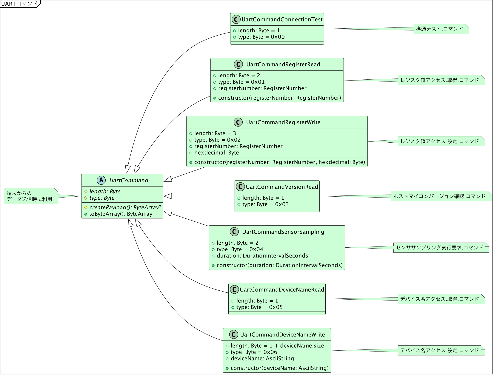

# サンプルコードの全体構造

{docsify-updated}

[サンプルコードで使用するUART通信仕様](common/command-interface)、および、[LINBLEセントラルアプリの基本フロー](common/flows/introduction)の内容を踏まえた、サンプルコード全体のクラス図を記載します。

## BLE制御

## UARTコマンドインタフェース

### コマンド側

### レスポンス・イベント側

### データクラス

