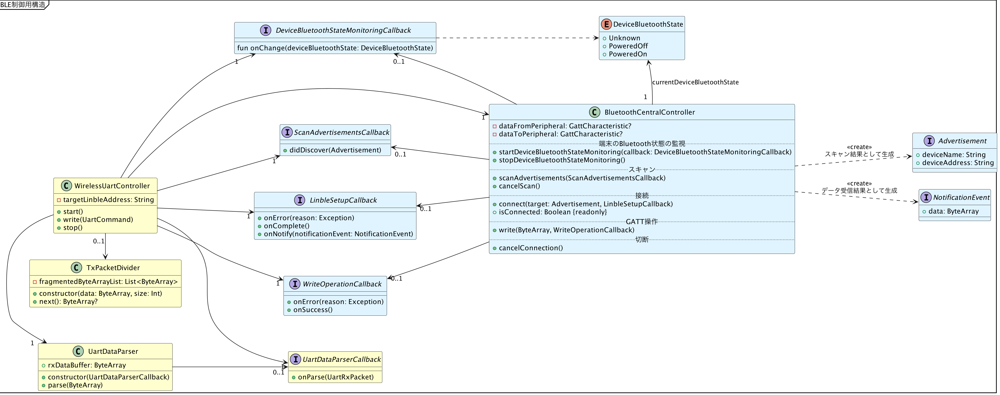

# サンプルコードの全体構造

{docsify-updated}

[サンプルコードで使用するUART通信仕様](common/command-interface)、および、[LINBLEセントラルアプリの基本フロー](common/flows/introduction)の内容を踏まえた、サンプルコード全体のクラス図を記載します。

## BLE制御

### WirelessUartControllerクラス

アプリのプレゼンテーション層（GUI制御クラスなど）に対する、操作の窓口役です。

GUIを通じてこのオブジェクトと対話することにより、BLE制御が行われていきます。

### BluetoothCentralControllerインタフェース

各BLE利用可能プラットフォームの、端末BLE状態監視・BLEスキャン・BLE接続操作を抽象化したインタフェースです。

各プラットフォーム向けのサンプルコードにおいて、このインタフェースを実装した`ConcreteBluetoothCentralController`クラスが提供され、そのクラス内で実際のBLE APIを利用したコードが実装されます。

### Linbleインタフェース

各BLE利用可能プラットフォームの、BLE接続後のGATT操作を抽象化したインタフェースです。

各プラットフォーム向けのサンプルコードにおいて、このインタフェースを実装した`ConcreteLinble`クラスが提供され、そのクラス内で実際のBLE APIを利用したコードが実装されます。

### TxPacketDividerクラス

[各UartCommand系サブクラス](#uartCommand系サブクラス)から生成された送信用バイト列を、MTUに合わせて分割するためのクラスです。

### UartDataParserクラス

[`Linble`](#linbleインタフェース)から入力されたNotificationバイト列をバッファリングし、[UART通信仕様](common/command-interface)で定めたパケット構造に則って解析を行い、[UartRxPacket系サブクラス](#uartRxPacket系サブクラス)を生成するためのクラスです。

## UARTコマンドインタフェース

### UartCommand系サブクラス

[UART通信仕様](common/command-interface)で定めた各コマンドを表現するクラスであり、自身を`ByteArray`化する能力を持ちます。

`WirelessUartController`へコマンド送信を要求するときに生成します。

#### UartRxPacket系サブクラス

[UART通信仕様](common/command-interface)で定めた各レスポンスおよびイベントを表現するクラスであり、`rxPayload`部分を解析する能力を持ちます。
