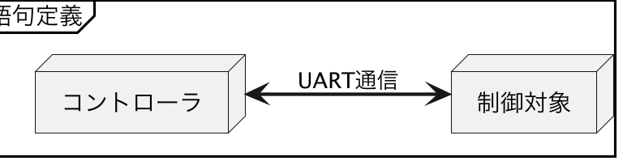

# サンプルコードで使用するUART通信仕様

{docsify-updated}

?> この通信仕様はサンプルコード開発のために用意した架空の仕様であり、LINBLEを使うために必要となる通信仕様ではありません。

この資料では、制御対象とコントローラの間を流れるUARTデータの仕様を定義します。

## 語句定義



**制御対象**とは、UART通信によって制御が可能な機器のことを指します。

**コントローラ**とは、UART通信によってその制御対象に対して指示を与え、UART通信によって返された応答を確認できる能力を有する機器を指します。

また、制御対象に対して与える指示データパケットのことを**コマンド**、制御対象からのコマンドに対する応答データパケットを**レスポンス**、制御対象からの任意のタイミングで送信されるデータパケットのことを**イベント**と呼ぶものとします。

?> LINBLEのペリフェラル動作を使ってこのUART通信を無線化した場合、制御対象は**ホストマイコン**、コントローラは**セントラルアプリ**と表現されます。


## パケットフォーマット

コマンド・レスポンス・イベントの全てのデータパケットは、以下の構造を持つものとします。

```
<length><type><payload>
```

|フィールド名|サイズ|役割|
|--|:--:|--|
|`<length>`|1|後続に何バイト続くかを決定します。後続の`<type>`は必ず指定されるため、このフィールドは必ず`1`以上の値を取ります。`<payload>`の長さに応じて変化します。|
|`<type>`|1|コマンド・レスポンス・イベントごとに割り当てられた一意の値です。|
|`<payload>`|?|コマンド・レスポンス・イベントごとに定められた実データ部です。サイズが`0`の可能性も有り得ます。|


## コマンド一覧

### 導通テスト

UARTインタフェースの導通、および、死活を確認するためのコマンドです。

?> 固定長のコマンドに対し、固定長のレスポンスを返す基本の通信パターンです。

**コマンド: type=0x00**

```
0100
```

**レスポンス: type=0x40**

```
0140
```

**例:**

```
Tx | 0100
Rx | 0140
```


### レジスタ値アクセス.取得

特定のレジスタ値の読み取りを行うためのコマンドです。

?> 固定長パラメータを持つコマンドに対し、固定長パラメータを持つレスポンスを返す通信パターンです。

**コマンド: type=0x01**

```
0201<registerNumber>
```

|パラメータ|サイズ|説明|
|:---|:---:|:---|
|`<registerNumber>`|1|値を取得したいレジスタ番号。`0`から`7`まで。例：`01`|

**レスポンス: type=0x41**

```
0341<registerNumber><hexdecimal>
```

|パラメータ|サイズ|説明|
|:---|:---:|:---|
|`<registerNumber>`|1|コマンドで指定されたレジスタ番号。`0`から`7`まで。例：`1`|
|`<hexdecimal>`|1|指定したレジスタ番号の現在値。例：`FF`|

**例:**

```
Tx | 020102
Rx | 034102FF
```

### レジスタ値アクセス.設定

特定のレジスタ値の書き込みを行うためのコマンドです。

**コマンド: type=0x02**

```
0302<registerNumber><hexdecimal>
```

|パラメータ|サイズ|説明|
|:---|:---:|:---|
|`<registerNumber>`|1|値を取得したいレジスタ番号。`0`から`7`まで。例：`1`|
|`<hexdecimal>`|1|指定したレジスタ番号に設定したい値。例：`FF`|

**レスポンス: type=0x42**

```
0142
```

**例:**

```
Tx | 0302040F
Rx | 0142
```

### ホストマイコンバージョン確認

ホストマイコン側のバージョン文字列を取得するためのコマンドです。

?> コマンドに対し、可変長パラメータを持つレスポンスを返す通信パターンです。

**コマンド: type=0x03**

```
0103
```

**レスポンス: type=0x43**

```
<length>43<version>
```

|パラメータ|サイズ|説明|
|:---|:---:|:---|
|`<version>`|?|ホストマイコンのバージョン情報を示す可変長のASCII文字列。例：`1.0.0`、または`0.1.0-debugMode`など|


**例:**

```
Tx | 0103
Rx | 0D43312E322E332E393837363534 // "1.2.3.987654"
```


### センササンプリング実行要求

ホストマイコン側に接続されたセンサのサンプリングを行わせ、定期的にそのデータを出力させるコマンドです。

?> コマンド・レスポンスの組み合わせとは別に、後から非同期にデータイベントを送る通信パターンです。

**コマンド: type=0x04**

```
0204<duration>
```

|パラメータ|サイズ|説明|
|:---|:---:|:---|
|`<duration>`|1|サンプリング期間秒数。`1`から`60`まで。|

**レスポンス: type=0x44**

```
0144
```

**イベント: type=0x84**

```
<length>84<state>[<value>]
```

|パラメータ|サイズ|説明|
|:---|:---:|:---|
|`<state>`|1|サンプリング継続状態。`1`または`0`。`1`の場合、後続に`<value>`が出現する。|
|`<value>`|4|取得したセンサ値の[IEEE754単精度(float)表現](https://tools.m-bsys.com/calculators/ieee754.php)の値。例：`42009062` (`32.141`)|

**例:**

```
Tx | 020405
Rx | 0144
Rx | 06840142F7D2F1 // 123.91199493408203125
Rx | 06840142F85062 // 124.1569976806640625
Rx | 06840142F82C8B // 124.08699798583984375
Rx | 06840142F7FBE7 // 123.99199676513671875
Rx | 06840142F7C51E // 123.8849945068359375
Rx | 028400
```


### デバイス名.取得

ホストマイコンの機器名を取得するためのコマンドです。

?> [ホストマイコンバージョン確認](#ホストマイコンバージョン確認)と同じく、可変長パラメータを持つレスポンスを返す通信パターンです。

**コマンド: type=0x05**

```
0105
```

**レスポンス: type=0x45**

```
<length>45<name>
```

|パラメータ|説明|
|:---|:---|
|`<name>`|デバイス名。ASCIIコードの印字可能範囲文字のみで構成された文字列。|

**例:**

```
Tx | 0105
Rx | 1A4553616D706C652D55617274436f6E74726F6C6C65722D303031 // Sample-UartController-001
```


### デバイス名.設定

ホストマイコンの機器名を設定するためのコマンドです。

?> 可変長パラメータを持つコマンドを送る通信パターンです。

**コマンド: type=0x06**

```
<length>06<name>
```

|パラメータ|説明|
|:---|:---|
|`<name>`|デバイス名。ASCIIコードの印字可能範囲文字のみで構成された文字列。|

**レスポンス: type=0x46**

```
0146
```

**例:**

```
Tx | 1A0653616D706C652D55617274436F6E74726F6C6C65722D303031 // Sample-UartController-001
Rx | 0146
```
