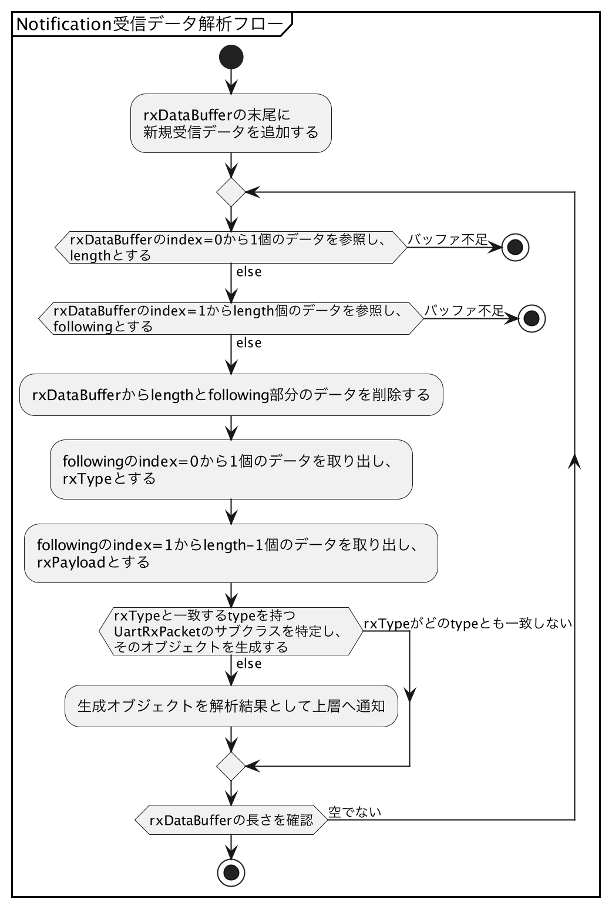

# LINBLEとの双方向通信

{docsify-updated}

[GATT準備](common/flows/prepare-gatt.md)が終わったら、ようやくLINBLEをまたいだBLE/UART通信を行えるようになります。

今回無線化対象としている[UART通信仕様](common/command-interface.md)では、[LINBLEへのデータ送信（Write）](#linbleへのデータ送信-write)が機器側で処理されたのち、機器からの応答UARTデータが[LINBLEからのデータ受信（Notification）](#linbleからのデータ受信-notification)で返ってくる想定をしています。

### LINBLEへのデータ送信 - Write

Write操作では、[GATT準備](common/flows/preapre-gatt.md)によって取得していた`Data To Peripheral`キャラクタリスティックを使用します。
このキャラクタリスティックに機器へ送り込みたいバイト列データを書き込めば、すぐにLINBLEをまたいだUART出力が発生します。

ただし、Writeするデータサイズについて注意しなければならないことがあります。

BLEのGATT通信の背後では、ATTプロトコルという通信制御の仕組みが働いています。
このプロトコルで使われる基本データサイズ（MTU: Maximum Transmission Unit。Bluetoothの仕様書では`ATT_MTU`と呼ばれています）は、デフォルトで23バイトとされています。
このうち、3バイトがATTプロトコルでのヘッダとして用いられるために、アプリ層では実質的に**20バイト**が基本データ長となっています。

多くのBLE利用可能プラットフォームのAPIでは、**キャラクタリスティックへ書き込むデータは、このMTUを意識したデータ長にしておかないと、通信不具合が発生する**ことがあります。

よって、**送信データサイズがMTUよりも大きくなる場合、MTUに合わせた分割送信を行う必要があります**。
このデータ分割を行うために`TxPacketDivider`クラスを導入し、MTUで分割した入力バイト列をイテレータ的に処理できるようにします。

またこの反復処理の実行タイミングもOSからの書き込み成否通知を待機する必要があり、少々面倒な実装をしなくてはなりません。

### LINBLEからのデータ受信 - Notification

機器から応答UARTデータが出力されると、[GATT準備](common/flows/prepare-gatt.md)によって取得していた`Data From Peripheral`キャラクタリスティックからのNotificationイベントが発生します。
このイベントが発生したときのキャラクタリスティックの値を解析すれば、機器からの出力データをアプリで解析することができます。

ただし、LINBLEからの受信データの解析時には[後述の注意点](#受信データの解析)があることに注意してください。

#### 受信データの解析

一般的なBLE製品においては、GATTのNotificationで得られるバイト列は、そのバイト列だけで意味を成すものであり、そのバイト列単独で応答内容を解析できるようになっていることが多いです。

一方、**LINBLEの動作仕様として、LINBLEへ入力したUARTデータは、複数回のNotificationに分かれる**という特性があり、ホストマイコンから送り出した10バイトのUARTデータは、1バイトのNotificationと9バイトのNotificationの2パケットに分離される可能性があります。

このため、**セントラルアプリ側では受信データをバッファリングしていき、受信の都度、バッファ内データが[通信仕様](common/command-interface.md)のレスポンスデータとして解釈できるかチェックする**ように実装する必要があります。

