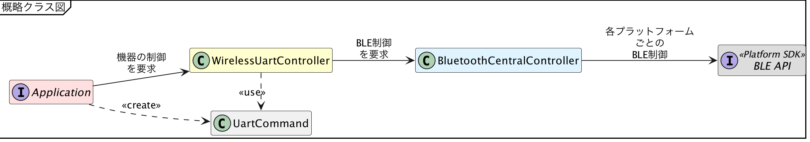

# 前書き

{docsify-updated}

?> 本資料は、セントラルアプリを構築するのに最低限必要となる知識について解説するものです。このため、BLEの仕様に関わる部分については、非常にざっくりとした説明をしています。BLEの仕様についてより詳しい情報が欲しい場合、[Bluetooth公式の仕様書](https://www.bluetooth.com/ja-jp/specifications/bluetooth-core-specification/)や、[Web上の他の資料](https://www.google.co.jp/search?q=Bluetooth+Low+Energy)などを参考にしてください。

## サンプルコードの基本構造

本サンプルコードでは、LINBLEを使って[既存のUART通信](common/command-interface.md)を無線化するというテーマのもと、以下のような基本構造を使って実装しています。

`Application`は、各プラットフォームのアプリにおける、標準的なエントリポイントを指します。Androidであれば`Activity`、iOSであれば`UIViewController`、Windows10-UWPであれば`Page`などを想定しています。

`Application`から`UartCommand`を生成後、それを`WirelessUartController`に渡すことで機器の制御を要求します。
次に、それを受けた`WirelessUartController`が`BluetoothCentralController`を適切に操作して、各プラットフォームごとに用意されている`BLE API`を制御します。
機器側から応答イベントが発生した場合、`BLE API`から`Application`に向かって、図内の矢印とは逆向きに応答受信イベントが伝播していきます。

## BLE制御の基本の流れ

BLE制御を行うアプリが取るべき処理の流れは、この解説ドキュメントの章の流れの通りです。すなわち、

1. [端末状態確認](common/flows/watch-bluetooth-service-state.md)
2. [アドバタイズスキャン](common/flows/scan-advertisements.md)
3. [BLE接続](common/flows/connect-to-target.md)
4. [GATT準備](common/flows/prepare-gatt.md)
5. [GATT通信](common/flows/communicate-with-linble.md)

の流れです。

!> 端末OSによっては、Bluetoothの操作を行う前に、特殊な利用権限をユーザーからもらっておく必要があります。Androidでは[Runtime Permissionの制御](https://developer.android.com/training/permissions/requesting?hl=ja)、iOSでは[NSBluetoothAlwaysUsageDescriptionによる利用確認](https://developer.apple.com/documentation/bundleresources/information_property_list/nsbluetoothalwaysusagedescription)などが該当します。

サンプルコードでは`Application`が操作可能となったら[端末状態確認](common/flows/watch-bluetooth-service-state.md)から開始しています。
