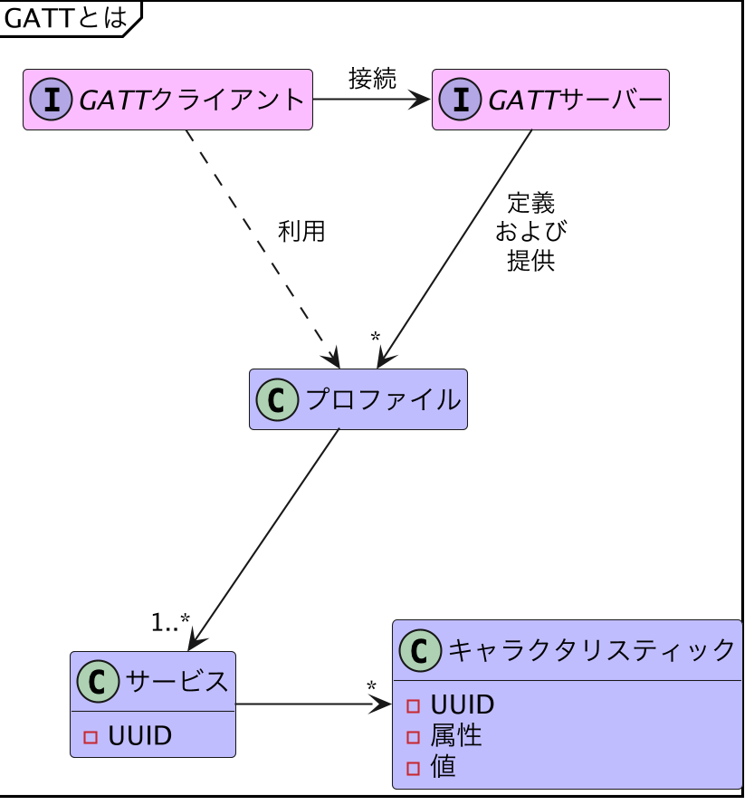

# GATT準備

{docsify-updated}

[BLE接続](common/flows/connect-to-target.md)に成功したら、最初に必ず、LINBLEとの双方向通信のためのGATT準備を行う必要があります。

## GATTとは

GATTとは、通常のBLE通信で使われる通信プロトコルです。

GATT通信では、`GATTクライアント`と`GATTサーバー`の2点間での通信方法を規定しています。BLE接続におけるセントラル・ペリフェラルは、GATTクライアント・GATTサーバーのどちらにもなれますが、大抵のBLE通信においてはセントラルがGATTクライアント、ペリフェラルがGATTサーバー役を担うことが多いです。

?> LINBLEセントラルアプリはGATTクライアント役を担い、LINBLEモジュールはGATTサーバー役を担います。

GATTサーバーは、`GATTプロファイル`と呼ばれるデータ構造を定義・提供します。
これは、`キャラクタリスティック`という1つのデータそのもの、またはデータ入出力のための1つの信号線を、`サービス`というカテゴリでグループ分けして整理したものです。
このデータ構造のことは**GATTデータベース**と呼称されます。

サービスとキャラクタリスティックには[`UUID`](https://ja.wikipedia.org/wiki/UUID)が割り当てられており、これによって特定のキャラクタリスティックが識別できるようになっています。
また、キャラクタリスティックには`属性`があり、基本的に読み書き可能性に関しての情報が定義されています。

GATTクライアントはキャラクタリスティックの`値`を変更したり（Write）、読み込んだり（Read）、値の変更を購読したり（Notify）することで通信を行います。

## GATTデータベースの検索

まずは接続先LINBLEのGATTデータベース構造がどうなっているかをOSに認識させるため、サービス・キャラクタリスティック検索を行います。
この操作によって、LINBLE側が定義するGATTサービス（`LINBLE UART Service`）へアクセスできるようになるので、それらを`BluetoothCentralController`オブジェクトに保持させます。

### LINBLE UART ServiceのUUID・属性定義

サービスUUIDは`27ADC9CA-35EB-465A-9154-B8FF9076F3E8`です。

双方向通信のために必要となるキャラクタリスティックは以下の2つです。

|名称|UUID|属性|役割|
|:---|:---|:---|:---|
|Data From Peripheral|`27ADC9CB-35EB-465A-9154-B8FF9076F3E8`|Notification|LINBLEからのデータ出力ポイント。|
|Data To Peripheral|`27ADC9CC-35EB-465A-9154-B8FF9076F3E8`|Write Without Response|LINBLEへのデータ入力ポイント。|

## Notificationの許可

`Data From Peripheral`キャラクタリスティックの制御オブジェクトが取得できたら、このキャラクタリスティックに対し、Notificationの許可を行います。

この操作が成功すると、ようやく[LINBLEとの双方向通信](common/flows/communicate-with-linble.md)が行えるようになります。

?> Notification許可に成功すると、LINBLEモジュール側は**オンライン状態**に遷移し、UART通信が有効化されます。LINBLE側の状態遷移の仕様については、[LINBLEのユーザーマニュアル](https://www.musen-connect.co.jp/products/download)をご確認ください。
