# 資料内で使用するPlantUML図

資料に使用する全てのPlantUMLソースコードを、コードブロックで記述します。

!> **本ファイルは資料開発者向けに用意しているものです。PlantUMLのオンラインレンダリングサービスへの負荷となってしまうため、このページへのGitHub Pagesからのアクセスが行われないようにしてください。**

### 開発者向け情報

* 普段は[Markdown Preview Enhanced](https://shd101wyy.github.io/markdown-preview-enhanced/)からレンダリング後のPlantUML図を確認しながら開発します。
* 図の調整が終わり次第、VSCodeの[PlantUMLプラグイン](https://marketplace.visualstudio.com/items?itemName=jebbs.plantuml)で「ファイル内のダイアグラムをエクスポート」を使って、pngファイルへの一括ビルドを行ってください。
* [PlantUML公式のレンダリングWeb API](http://plantuml.com/ja/)には転送量制限があるため、開発中の積極使用は避け、ローカルの `plantuml.jar` が使用されるように設定してください。

## PlantUML

### 語句定義

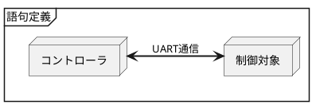

### 概略クラス図

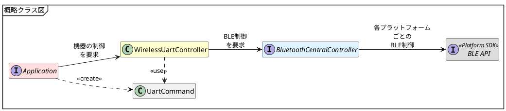

### BLE制御開始シーケンス

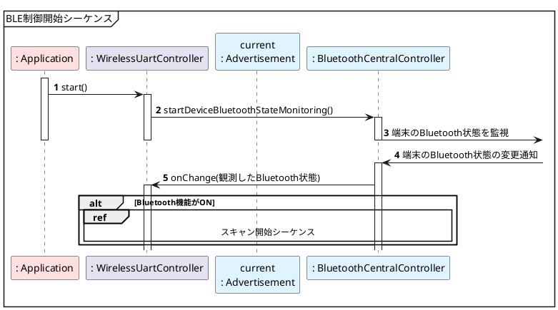

### スキャン開始シーケンス

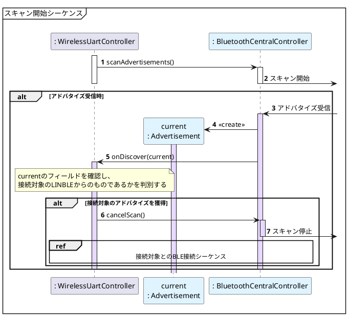

## 接続対象とのBLE接続シーケンス

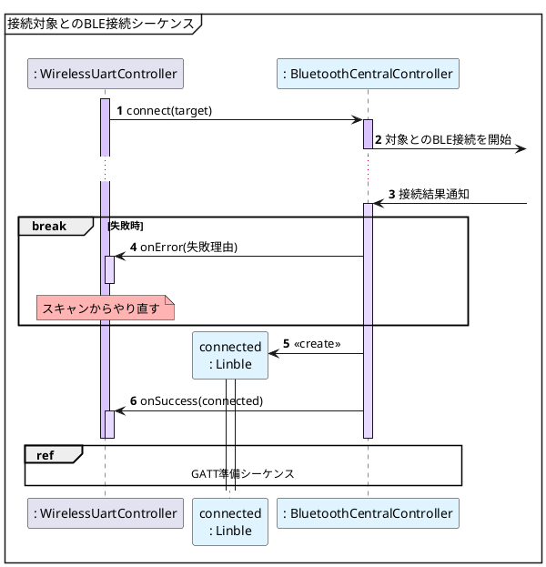

### GATT準備シーケンス

#### GATTとは

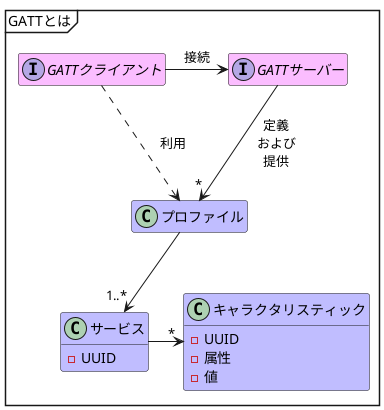

#### サービス・キャラクタリスティックの検索

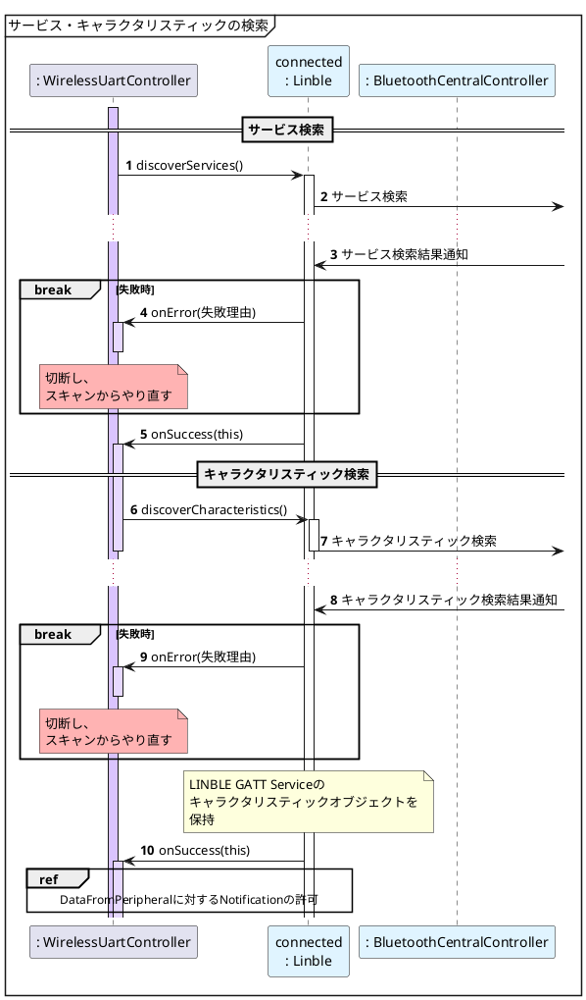

#### DataFromPeripheralに対するNotificationの許可

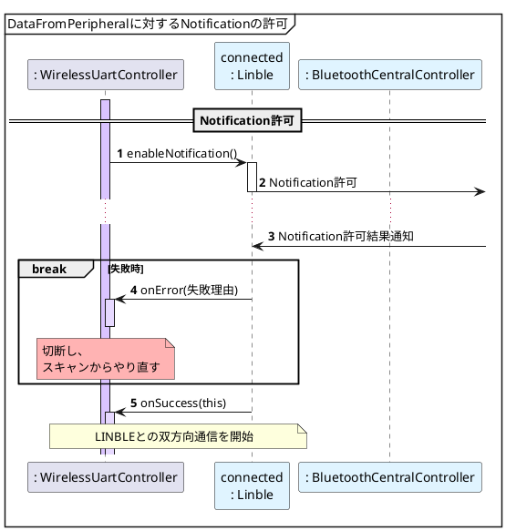

### データ送信シーケンス

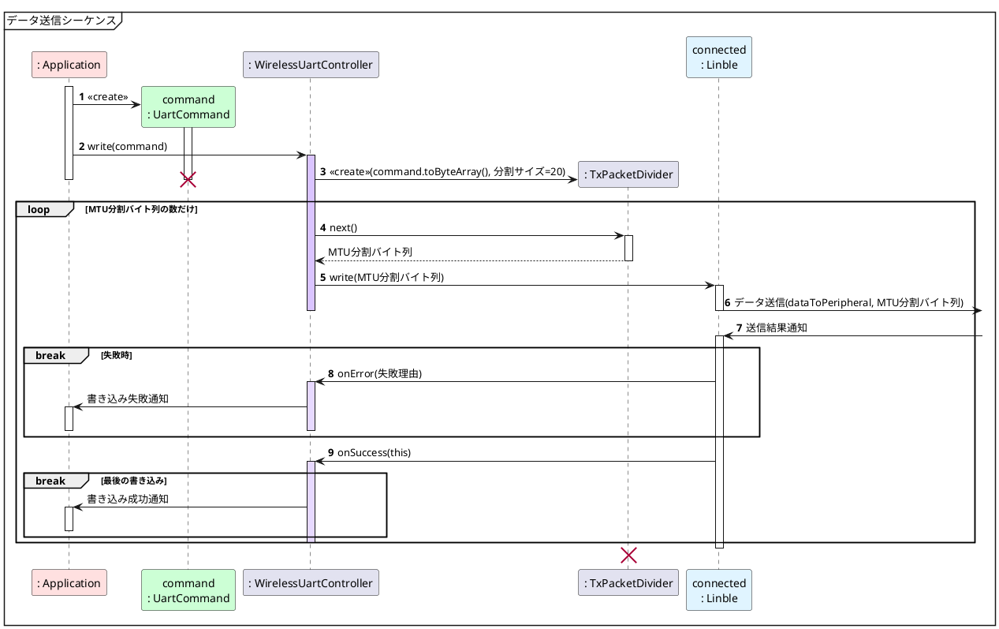

### Notification受信シーケンス

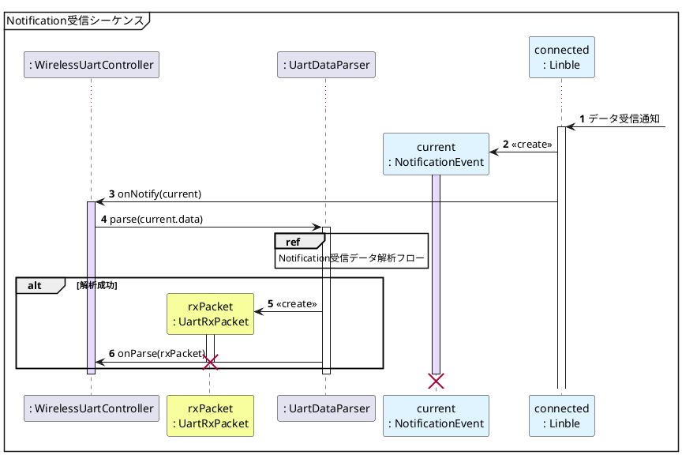

#### Notification受信データ解析フロー

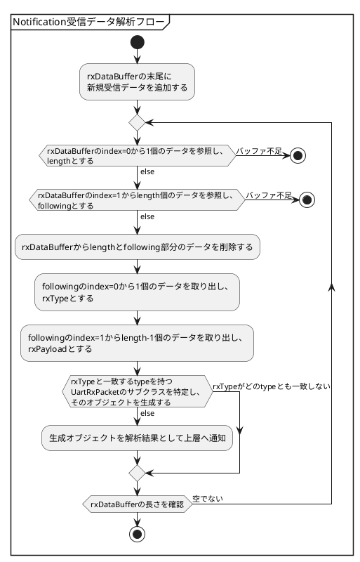

## BLE制御の停止

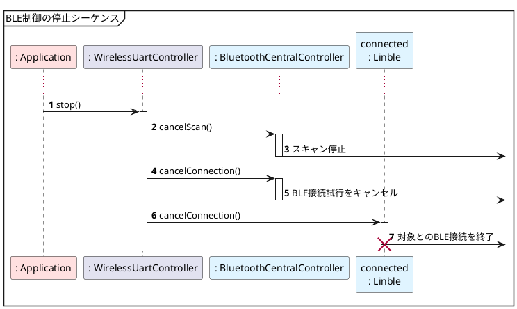

### BLE制御構造

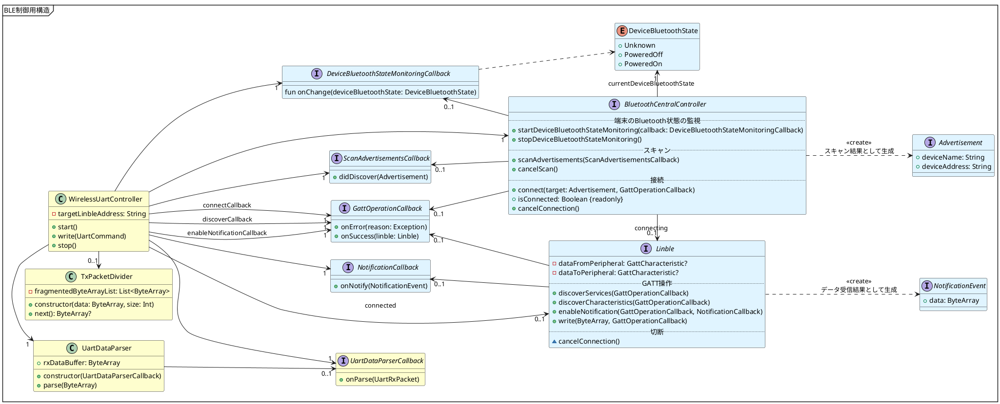

### UARTコマンドインタフェース

#### コマンド側

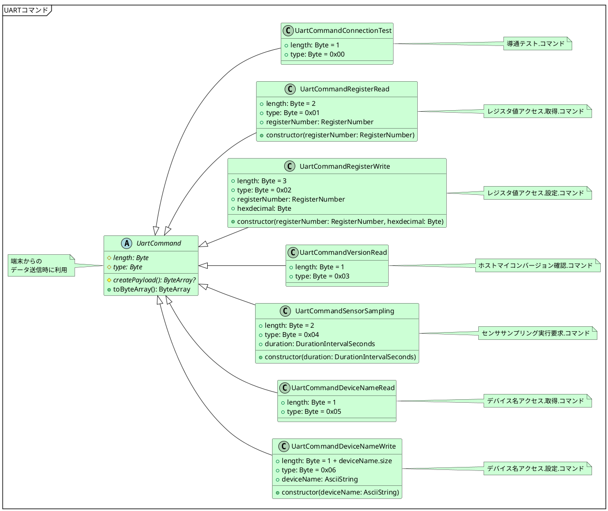

#### レスポンス・イベント側

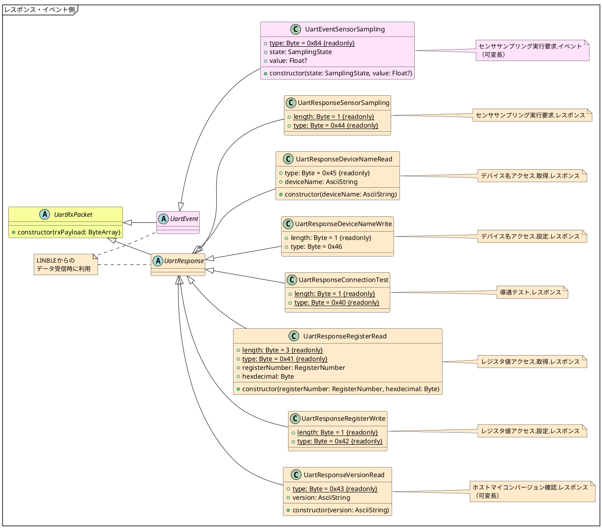

#### データクラス

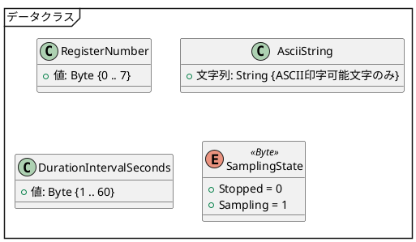

