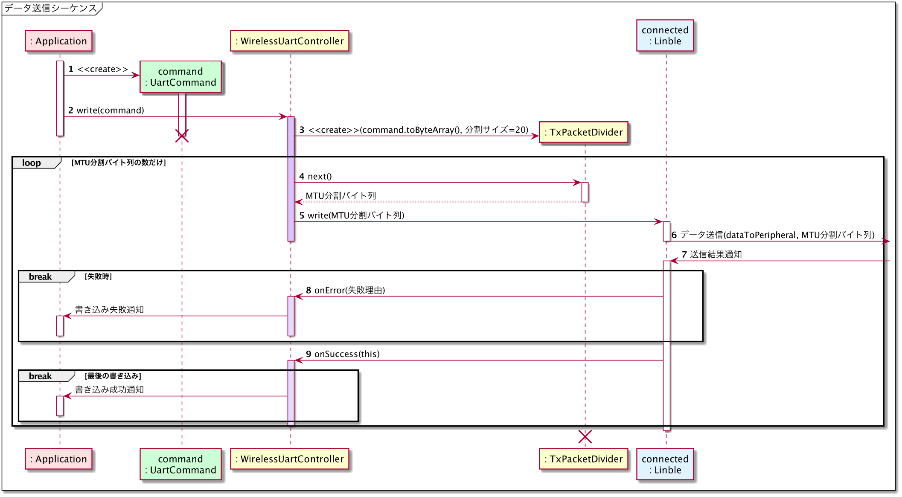
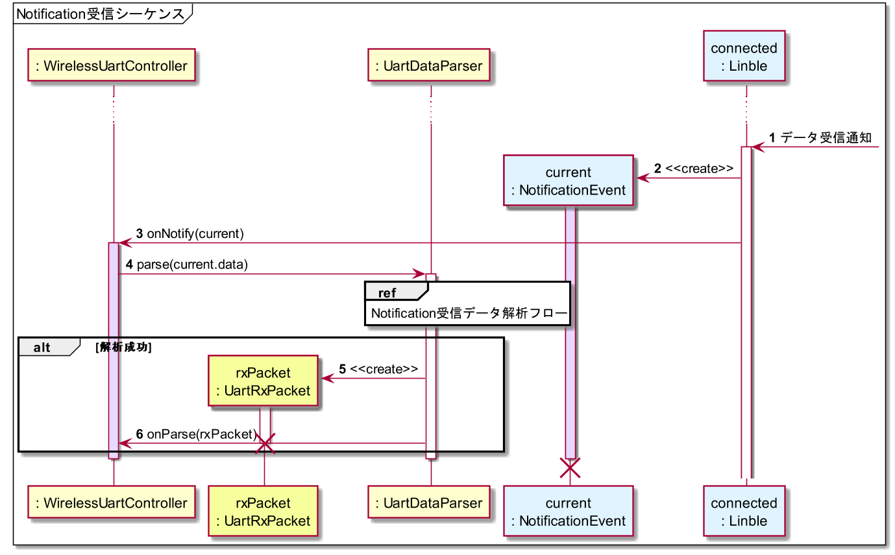

# Android版サンプルコード - LINBLEとの双方向通信

{docsify-updated}

## LINBLEへのデータ送信 - Write

> 参考: BLEとLINBLEの基本制御フロー: LINBLEとの双方向通信: [LINBLEへのデータ送信 - Write](common/flows/communicate-with-linble#linbleへのデータ送信-write)
> 
> 

LINBLEへのデータ送信を行うためには、`dataToPeripheral`キャラクタリスティックに対し`Write Without Response`操作を行います。

```kotlin
val dataToPeripheral = linbleUartService.characteristics
    .firstOrNull { 
        it.uuid == Linble.GattUuid.dataToPeripheral
    } ?: return
```

のようにして`BluetoothGattCharacteristic`オブジェクトを取り出した後、Androidバージョンごとに分岐します。

Android 13以降では、[BluetoothGatt.writeCharacteristic(characteristic, value, writeType)]( https://developer.android.com/reference/android/bluetooth/BluetoothGatt#writeCharacteristic(android.bluetooth.BluetoothGattCharacteristic,%20byte[],%20int) )を呼び出します。

Android 13未満では、`BluetoothGattCharacteristic`オブジェクトに対して送信データとWriteTypeをセットしてから、その後[BluetoothGatt.writeCharacteristic(characteristic)]( https://developer.android.com/reference/android/bluetooth/BluetoothGatt#writeCharacteristic(android.bluetooth.BluetoothGattCharacteristic) )を呼び出します。

```kotlin
val succeeded =
    if (Build.VERSION.SDK_INT >= Build.VERSION_CODES.TIRAMISU) {
        val status = gatt.writeCharacteristic(
            dataToPeripheral, data, BluetoothGattCharacteristic.WRITE_TYPE_NO_RESPONSE
        )

        status == BluetoothGatt.GATT_SUCCESS
    } else {
        dataToPeripheral.value = data
        dataToPeripheral.writeType = BluetoothGattCharacteristic.WRITE_TYPE_NO_RESPONSE

        val result = gatt.writeCharacteristic(dataToPeripheral)

        result
    }

if (!succeeded) {
    // TODO: 失敗時の処理
    return
}
```

### セットしたデータ長がMTUを超えていた場合、超過分のデータは破棄される

Androidでのデータ送信では、[基本制御フロー](common/flows/communicate-with-linble#linbleへのデータ送信-write)で説明した通り、MTUによるデータ分割の実装は必須です。

Android OSにデータ送信を要求すると、その要求結果が[`BluetoothGattCallback.onCharacteristicWrite()`]( https://developer.android.com/reference/android/bluetooth/BluetoothGattCallback.html#onCharacteristicWrite(android.bluetooth.BluetoothGatt,%20android.bluetooth.BluetoothGattCharacteristic,%20int) )で通知されますので、これをトリガーとして次の分割データを送るように繰り返し処理を構築します。


## LINBLEからのデータ受信 - Notification

> 参考: BLEとLINBLEの基本制御フロー: LINBLEとの双方向通信: [LINBLEからのデータ送信 - Notification](common/flows/communicate-with-linble#linbleからのデータ送信-notification)
> 
> 

LINBLEからのNotificationを受信すると、[`BluetoothGattCallback.onCharacteristicChanged()`]( https://developer.android.com/reference/android/bluetooth/BluetoothGattCallback.html#onCharacteristicChanged(android.bluetooth.BluetoothGatt,%20android.bluetooth.BluetoothGattCharacteristic,%20byte[]) )が発生します。

!> Android 13未満に対応するアプリの場合、Notification受信用コールバック関数の実装の仕方に注意が必要です。<br>
<br>
Android 13未満でのNotification受信時の関数は<br>
`onCharacteristicChanged(gatt, characteristic)`<br>
でしたが、Android 13以降では引数定義が変更された<br>
`onCharacteristicChanged(gatt, characteristic, value)`<br>
が新しく追加され、こちらが呼び出されるようになっています。<br>
<br>
後方互換性のためか、この新しいコールバック関数のsuperメソッド（デフォルト実装）は**古いコールバック関数を暗黙的に呼び出す**ようになっています。<br>
従って、1回のNotificationごとに古いコールバック関数・新しいコールバック関数が続けて実行されることになり、**受信処理の二重実行を誘発する原因**となってしまいます。<br>
<br>
サンプルコードでは古いコールバック関数の方で実行中Androidバージョンを調べ、早期returnによって二重処理となってしまう状況を防いでいます。<br>
<br>
※なお、この挙動は`onCharacteristicRead()`や`onDescriptorRead()`でも発生します。

```kotlin
// Android 13以降
override fun onCharacteristicChanged(
    gatt: BluetoothGatt,
    characteristic: BluetoothGattCharacteristic,
    value: ByteArray
) {
    super.onCharacteristicChanged(gatt, characteristic, value)
    // ↑ 注意: この内部で、下記
    // onCharacteristicChanged(gatt, characteristic)
    // が呼び出される

    handleNotifiedValue(value)
}

// Android 13未満
@Suppress("DEPRECATION")
@Deprecated("Deprecated in Java")
override fun onCharacteristicChanged(
    gatt: BluetoothGatt?,
    characteristic: BluetoothGattCharacteristic?
) {
    super.onCharacteristicChanged(gatt, characteristic)

    // Android 13以降の場合は
    // onCharacteristicChanged(gatt, characteristic, value)
    // のデフォルト実装でここに進入してくる
    // 
    // 新しいコールバック関数の方で処理するべきなので、早期return
    if (Build.VERSION.SDK_INT >= Build.VERSION_CODES.TIRAMISU) {
        return
    }

    val value = characteristic?.value ?: return
    
    handleNotifiedValue(value)
}

private fun handleNotifiedValue(notifiedValue: ByteArray) {
    // ... 受信データを使った処理 ...
}
```
