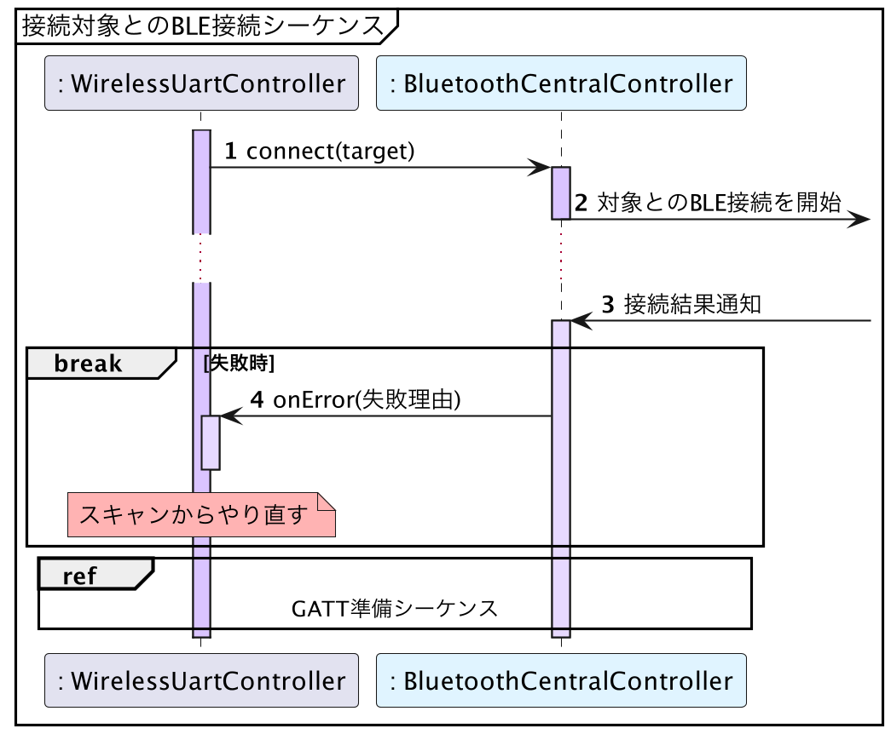

# Android版サンプルコード - BLE接続

{docsify-updated}

> 参考: BLEとLINBLEの基本制御フロー: [BLE接続](common/flows/connect-to-target.md)
> 
> 

[アドバタイズのスキャン]( platform/android/scan-advertisements )で取得した`ScanRecord`に対し、[`getDevice()`]( https://developer.android.com/reference/android/bluetooth/le/ScanResult.html#getDevice() )を呼ぶことで、[`BluetoothDevice`]( https://developer.android.com/reference/android/bluetooth/BluetoothDevice.html )オブジェクトが得られます。
そして、[`BluetoothDevice.connectGatt()`]( https://developer.android.com/reference/android/bluetooth/BluetoothDevice.html#connectGatt(android.content.Context,%20boolean,%20android.bluetooth.BluetoothGattCallback) )を呼び出すことで、BLE接続を行うことができます。

この接続結果は、[`BluetoothGattCallback.onConnectionStateChange()`]( https://developer.android.com/reference/android/bluetooth/BluetoothGattCallback.html#onConnectionStateChange(android.bluetooth.BluetoothGatt,%20int,%20int) )で通知されます。

## AndroidでのBLE接続は失敗しやすい

Android端末にもよりますが、<u>**`BluetoothGatt.connectGatt()`は比較的高い頻度で失敗します**</u>。

何回かリトライを行えば何事もなかったかのように正常に接続できることが常ですので、リトライ用のロジックは必ず搭載すべきです。

サンプルコードでは接続できるまで無限にリトライをしかけていますが、実際のアプリでは数回失敗したら接続を諦め、ユーザーへエラーを報告した方がよいでしょう。

!> `onConnectionStateChange()`では接続失敗に関するエラーコードも回収できます。しかし、残念ながらほとんどのエラーが`133`という汎用エラーコードで通知されるようになっており、あまり参考にはなりません。

