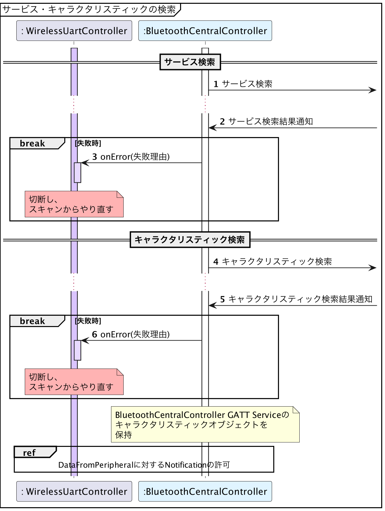

# Android版サンプルコード - GATT準備

{docsify-updated}

> 参考: BLEとLINBLEの基本制御フロー: [GATT準備](common/flows/prepare-gatt.md)


## GATTデータベースの検索

> 参考: BLEとLINBLEの基本制御フロー: GATT準備: [GATTデータベースの検索](common/flows/prepare-gatt#gattデータベースの検索)
> 
> 

サービス検索とキャラクタリスティック検索は、[BluetoothGatt.discoverServices()]( https://developer.android.com/reference/android/bluetooth/BluetoothGatt#discoverServices() )を呼ぶことで同時に行われます。

この操作により、接続しているGATTサーバー側の全てのサービス・キャラクタリスティックが調査されます。

調査が成功したら[`BluetoothGattCallback.onServicesDiscovered()`]( https://developer.android.com/reference/android/bluetooth/BluetoothGattCallback#onServicesDiscovered(android.bluetooth.BluetoothGatt,%20int) )が呼び出されます。


## Notificationの許可

> 参考: BLEとLINBLEの基本制御フロー: GATT準備: [Notificationの許可](common/flows/prepare-gatt#notificationの許可)
> 
> 

AndroidでのNotification許可は、少々多めのコードを書かなければなりません。

1. サービス・キャラクタリスティック検索完了後、Notification許可を行いたいキャラクタリスティックに関する[`BluetoothGattCharacteristic`]( https://developer.android.com/reference/android/bluetooth/BluetoothGattCharacteristic.html )オブジェクトを取り出します。

[LINBLE UART ServiceのUUID定義]( common/flows/prepare-gatt#linble-uart-serviceのuuid・属性定義 )は、

```kotlin
interface Linble {
    object GattUuid {
        val linbleUartService
            = UUID.fromString("27ADC9CA-35EB-465A-9154-B8FF9076F3E8")!!

        val dataFromPeripheral
            = UUID.fromString("27ADC9CB-35EB-465A-9154-B8FF9076F3E8")!!

        val dataToPeripheral
            = UUID.fromString("27ADC9CC-35EB-465A-9154-B8FF9076F3E8")!!
    }
}
```

のように実装できます。

Notification許可をしたいのは`dataFromPeripheral`に関する`BluetoothGattCharacteristic`です。
Kotlinのコレクション操作関数[`firstOrNull()`]( https://kotlinlang.org/api/latest/jvm/stdlib/kotlin.collections/first-or-null.html )を使えば、`dataFromPeripheralCharacteristic`の取り出しは

```kotlin
val linbleUartService = gatt.services
    ?.firstOrNull {
        it.uuid == Linble.GattUuid.linbleUartService
    } ?: return

val dataFromPeripheralCharacteristic = linbleUartService.characteristics
    .firstOrNull { 
        it.uuid == Linble.GattUuid.dataFromPeripheral 
    } ?: return
```

のように書けます。

2. 取り出した`dataFromPeripheralCharacteristic`を使って、[`BluetoothGatt.setCharacteristicNotification()`]( https://developer.android.com/reference/android/bluetooth/BluetoothGatt#setCharacteristicNotification(android.bluetooth.BluetoothGattCharacteristic,%20boolean) )を実行します。

```kotlin
val succeeded = gatt
    .setCharacteristicNotification(dataFromPeripheralCharacteristic, true)

if (!succeeded) {
    // TODO: 失敗時の処理
    return
}
```

これによって、Android OSがこのキャラクタリスティックから発生したNotificationを受け取ったとき、このアプリにイベントを横流ししてくれるようになります。

3. `dataFromPeripheralCharacteristic`から、*Client Characteristic Configuration Descriptor（通称CCCD）*についての[`BluetoothGattDescriptor`]( https://developer.android.com/reference/android/bluetooth/BluetoothGattDescriptor )オブジェクトを取得します。

```kotlin
val dataFromPeripheralCccd = dataFromPeripheralCharacteristic
        .getDescriptor(BluetoothLowEnergySpec.GattUuid.cccd) ?: return
```

[GATTとは]( common/flows/prepare-gatt?id=gattとは )の説明では省略していましたが、キャラクタリスティックにはUUID、属性、値の他、**ディスクリプタ**という、そのキャラクタリスティックに関する追加情報リストが備わっています。
ディスクリプタはキャラクタリスティックと同様に、UUIDと値を持っています。

CCCDは、BLEの規格で決められているものであり、そのキャラクタリスティックからのNotification発生を許可するかどうかを制御するフラグを持っています。

CCCDのUUIDは全てのBLE製品で共通ですが、Android BLEフレームワークではこのUUIDオブジェクトが公開されていないため、BLEアプリ側で都度用意する必要があります。

```kotlin
object BluetoothLowEnergySpec {
    object GattUuid {
        val cccd
            = UUID.fromString("00002902-0000-1000-8000-00805f9b34fb")!!
    }
}
```

<div id="write-descriptor"></div>

4. [`BluetoothGatt.writeDescriptor(descriptor, value)`]( https://developer.android.com/reference/android/bluetooth/BluetoothGatt#writeDescriptor(android.bluetooth.BluetoothGattDescriptor,%20byte[]) )を実行します。

ただし、Android 13以降と未満で使用するメソッドが異なるので、Androidバージョンに応じて分岐する必要があります。

Android 13未満では、`dataFromPeripheralCccd`の`value`に`ENABLE_NOTIFICATION_VALUE`をセットしてから、`BluetoothGatt.writeDescriptor(descriptor)`を実行します。

```kotlin

@Suppress("DEPRECATION")
succeeded = if (Build.VERSION.SDK_INT >= Build.VERSION_CODES.TIRAMISU) {
    val status = gatt.writeDescriptor(
        dataFromPeripheralCccd,
        BluetoothGattDescriptor.ENABLE_NOTIFICATION_VALUE
    )
    status == BluetoothGatt.GATT_SUCCESS
} else {    
    dataFromPeripheralCccd.value = BluetoothGattDescriptor.ENABLE_NOTIFICATION_VALUE
    gatt.writeDescriptor(dataFromPeripheralCccd)
}

val succeeded = gatt.writeDescriptor(dataFromPeripheralCccd)

if (!succeeded) {
    // TODO: 失敗時の処理
    return
}
```

この操作によってようやくLINBLE側にNotification許可イベントが走り、その通信結果が[`BluetoothGattCallback.onDescriptorWrite()`]( https://developer.android.com/reference/android/bluetooth/BluetoothGattCallback.html#onDescriptorWrite(android.bluetooth.BluetoothGatt,%20android.bluetooth.BluetoothGattDescriptor,%20int) )で通知されます。

これでようやくLINBLEとの通信準備が完了します。
