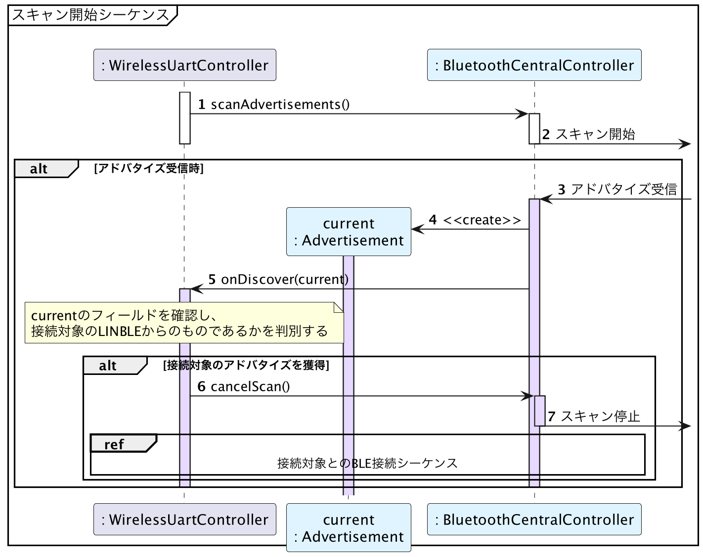

# Android版サンプルコード - アドバタイズのスキャン

{docsify-updated}

> 参考: BLEとLINBLEの基本制御フロー: [アドバタイズのスキャン](common/flows/scan-advertisements.md)
>
> 

AndroidでのBLEスキャンには、[`BluetoothLeScanner`]( https://developer.android.com/reference/android/bluetooth/le/BluetoothLeScanner )を使用します。

このオブジェクトは[`BluetoothAdapter.getBluetoothLeScanner()`]( https://developer.android.com/reference/android/bluetooth/BluetoothAdapter.html#getBluetoothLeScanner() )で取得できます。ただし、Bluetooth状態がオフのときは`null`が返りますので、事前に[端末の状態の確認](#端末の状態の確認)を行っておくことが重要です。

スキャン結果は[`ScanCallback.onScanResult()`]( https://developer.android.com/reference/android/bluetooth/le/ScanCallback.html#onScanResult(int,%20android.bluetooth.le.ScanResult) )で渡される[`ScanResult`]( https://developer.android.com/reference/android/bluetooth/le/ScanResult.html )オブジェクトから取り出すことができます。

なお、スキャン開始時に指定した[`ScanCalback`]( https://developer.android.com/reference/android/bluetooth/le/ScanCallback )オブジェクトはスキャン停止のためにも必要になるので、`ScanCalback`はフィールドで保持しておく必要があります。
