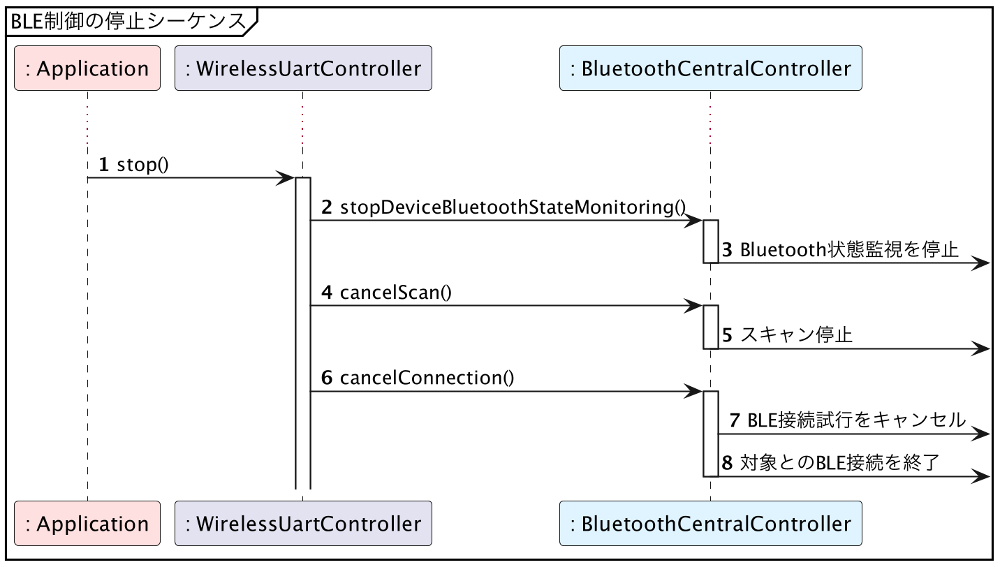

# Android版サンプルコード - BLE制御の終了

{docsify-updated}

> 参考: BLEとLINBLEの基本制御フロー: [BLE制御の終了](common/flows/stop-all-controls.md)
> 
> 

BLEスキャンを停止するためには、[`BluetoothLeScanner.stopScan()`]( https://developer.android.com/reference/android/bluetooth/le/BluetoothLeScanner.html#stopScan(android.bluetooth.le.ScanCallback) )を呼び出します。
このとき、スキャン開始のために使用した`ScanCallback`を渡す必要があります。

BLE通信の切断をするためには、[`BluetoothGatt.close()`]( https://developer.android.com/reference/android/bluetooth/BluetoothGatt.html#close() )を呼び出します。
`close()`を呼び出した`BluetoothGatt`オブジェクトは機能しなくなり、その後、いかなる`BluetoothGattCallback`イベントも発生しなくなります。

## 切断APIが2種類あるが、close()を使うべき

BLE通信を切断するAPIは他にも[`BluetoothGatt.disconnect()`]( https://developer.android.com/reference/android/bluetooth/BluetoothGatt.html#disconnect() )がありますが、**弊社ではこちらは利用非推奨と考えています**。

!> **非推奨としている理由:** `disconenct()`で切断した場合、`BluetoothGattCallback.onConnectionStateChange()`が発生します。多くの場合、切断という行為において、その操作の完了をアプリが待機しなければならない道理はありません。
切断はOS内部のバックグラウンド動作に任せてしまい、アプリでは次の処理に移った方が簡単と言えます。
また、`onConnectionStateChange()`は通信異常による切断時にも発生するため、その切断イベントが自分から切断した正常系によるものなのか、相手から切られた異常系によるものなのかを判断する必要が生じ、コードを余計に複雑にしてしまいます。
