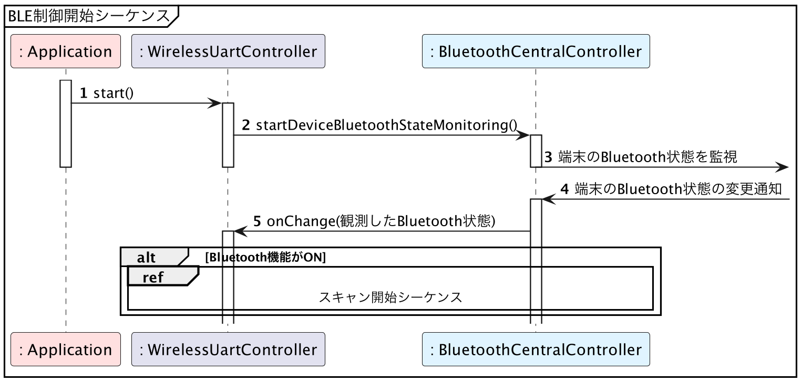

# Android版サンプルコード - 端末の状態の確認

{docsify-updated}

> 参考: BLEとLINBLEの基本制御フロー: [端末の状態の確認](common/flows/watch-bluetooth-service-state.md)
>
> 

AndroidでBluetooth状態の監視を行う場合、[ブロードキャスト]( https://developer.android.com/guide/components/broadcasts.html )の仕組みを用います。


## 位置情報機能の状態確認も必要

ただし、**Android6以降〜Android12未満でBLEスキャンを利用するためには、位置情報機能が有効になっている必要があります。**
このあたりのOSバージョンをサポートしようとする場合は、位置情報機能の状態確認についても同時に行われるべきです。

Bluetooth機能の状態が変更されると、`BluetoothAdapter.ACTION_STATE_CHANGED`がブロードキャストされます。位置情報機能の状態が変更されると、`LocationManager.PROVIDERS_CHANGED_ACTION`がブロードキャストされます。

これらのアクションを[`IntentFilter.addAction()`]( https://developer.android.com/reference/android/content/IntentFilter.html#addAction(java.lang.String) )で監視対象として、その`IntentFilter`を使うレシーバを[`Context.registerReceiver()`]( https://developer.android.com/reference/android/content/Context.html#registerReceiver(android.content.BroadcastReceiver,%20android.content.IntentFilter) )で登録します。

```kotlin
applicationContext.registerReceiver(bluetoothStateBroadcastReceiver, IntentFilter().also {
    it.addAction(BluetoothAdapter.ACTION_STATE_CHANGED)
    it.addAction(LocationManager.PROVIDERS_CHANGED_ACTION)
})
```

登録された`bluetoothStateBroadcastReceiver`の[`onReceive()`](https://developer.android.com/reference/android/content/BroadcastReceiver#onReceive(android.content.Context,%20android.content.Intent))が呼び出されたら、その時のBluetooth機能・位置情報機能の状態を確認し直し、それらを統合したものを現在の端末のBluetooth状態として取り扱います。

```kotlin
private fun updateCurrentDeviceBluetoothState(context: Context) {
    val bluetoothIsPoweredOn = BluetoothAdapter.getDefaultAdapter().isEnabled

    currentDeviceBluetoothState = if (bluetoothIsPoweredOn) {
        if (Build.VERSION.SDK_INT >= Build.VERSION_CODES.S) {
            DeviceBluetoothState.PoweredOn
        } else {
            // 古い OS をサポートする場合、
            // 位置情報機能が ON になっていることも確認します
            val locationManager = context.getSystemService(LocationManager::class.java)
            if (locationManager.isProviderEnabled(LocationManager.NETWORK_PROVIDER)) {
                DeviceBluetoothState.PoweredOn
            } else {
                DeviceBluetoothState.PoweredOnButDisabledLocationService
            }
        }
    } else {
        DeviceBluetoothState.PoweredOff
    }
}
```

?> [構造図](common/classes.md)内の列挙型`DeviceBluetoothState`は、端末のBluetooth状態として`Unknown`・`PoweredOff`・`PoweredOn`の3値を想定していましたが、Androidのサンプルコードでは新たに`PoweredOnButDisabledLocationService`の値を追加しています。

