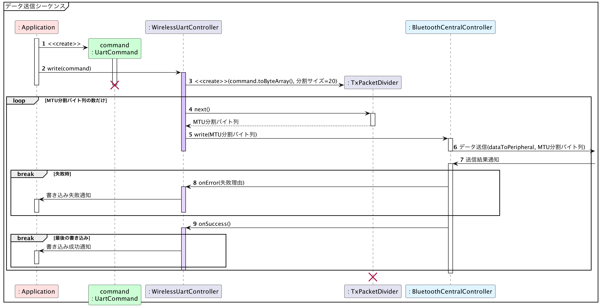
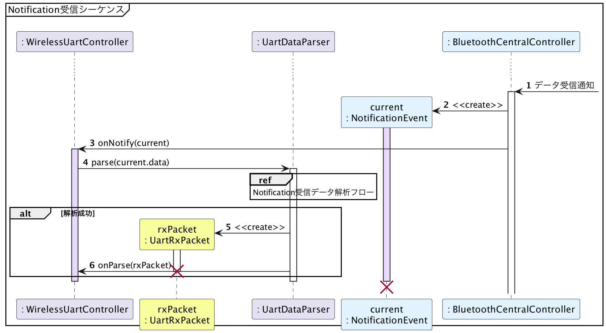

# iOS版サンプルコード - LINBLEとの双方向通信

{docsify-updated}

## LINBLEへのデータ送信 - Write

> 参考: BLEとLINBLEの基本制御フロー: LINBLEとの双方向通信: [LINBLEへのデータ送信 - Write](common/flows/communicate-with-linble#linbleへのデータ送信-write)
>
> 

データ送信を行う場合、[`CBPeripheral.writeValue(_:for:type:)`](<https://developer.apple.com/documentation/corebluetooth/cbperipheral/writevalue(_:for:type:)>)を呼び出します。

LINBLEへのデータ送信を行うためには`dataToPeripheral`キャラクタリスティックを操作すればいいので、

```swift
guard let dataToPeripheral = linbleUartService.characteristics?.first(where: {
    $0.uuid == Linble.dataToPeripheral
}) else { return }
```

で`BluetoothGattCharacteristic`オブジェクトを取り出しておき、

```swift
peripheral.writeValue(data, for: dataToPeripheral, type: .withoutResponse)
```

のように実装します。

### セットしたデータ長がMTUを超えていた場合、特殊な書き込みシーケンスが起きる

iOSでのデータ送信では [Android と異なり](platform/android/communicate-with-linble#セットしたデータ長がmtuを超えていた場合、超過分のデータは破棄される) 、実は[基本制御フロー](common/flows/communicate-with-linble#linbleへのデータ送信-write)で説明したMTUによるデータ分割の実装は必須ではありません。

Appleの公式ドキュメントで説明されていませんが、[`writeValue(_:for:type:)`](<https://developer.apple.com/documentation/corebluetooth/cbperipheral/writevalue(_:for:type:)>)にMTUを超えるサイズのデータを渡した場合、`Write Long Characteristic Values`と呼ばれる特殊なシーケンスでの書き込みが行われるようになります。

この特殊シーケンスで書き込みが成功するかはPeripheralデバイス側の仕様によります。

LINBLE では一応成功するようになってはいますが、 BLE 通信上ではなるべく Android との差が無くなるように作るほうがトラブルを回避できると考えられるため、データ分割書き込みは行うようにしてください。

iOSで分割書き込みをするには、[`CBPeripheral.canSendWriteWithoutResponse`](https://developer.apple.com/documentation/corebluetooth/cbperipheral/cansendwritewithoutresponse) と [`CBPeripheralDelegate.peripheralIsReady(toSendWriteWithoutResponse:)`](<https://developer.apple.com/documentation/corebluetooth/cbperipheraldelegate/peripheralisready(tosendwritewithoutresponse:)>) の 2 つを組み合わせます。

```swift
func writeDataChunk(_ chunk: Data) {
    // この chunk は必ず MTU サイズ以下で分割されていること

    if !peripheral.canSendWriteWithoutResponse {
        // 現在送信できないようであれば、 pendingChunk に待避し、
        // peripheralIsReady() が呼ばれるのを待つ
        pendingChunk = chunk
        return
    }

    peripheral.writeValue(chunk, for: dataToPeripheral, type: .withoutResponse)

    pendingChunk = nil

    // 次の chunk があるならばそれを書き込む
    if let nextChunk = getNextDataChunk() {
        writeDataChunk(nextChunk)
    }
}

private var pendingChunk: Data? = nil
```
```swift
// CBPeripheralDelegate
func peripheralIsReady(toSendWriteWithoutResponse peripheral: CBPeripheral) {
    // peripheralIsReady() のスコープでは
    // peripheral.canSendWriteWithoutResponse == true
    // となっていることが期待できる

    // 保留していた chunk があるならばそれを書き込む
    if let pendingChunk {
        writeDataChunk(pendingChunk)
    }
}
```

## LINBLEからのデータ受信 - Notification

> 参考: BLEとLINBLEの基本制御フロー: LINBLEとの双方向通信: [LINBLEからのデータ送信 - Notification](common/flows/communicate-with-linble#linbleからのデータ送信-notification)
>
> 

LINBLEからのNotificationを受信すると、[`peripheral(_:didUpdateValueFor:error:)`](<https://developer.apple.com/documentation/corebluetooth/cbperipheraldelegate/peripheral(_:didupdatevaluefor:error:)-1xyna>)が発生します。
