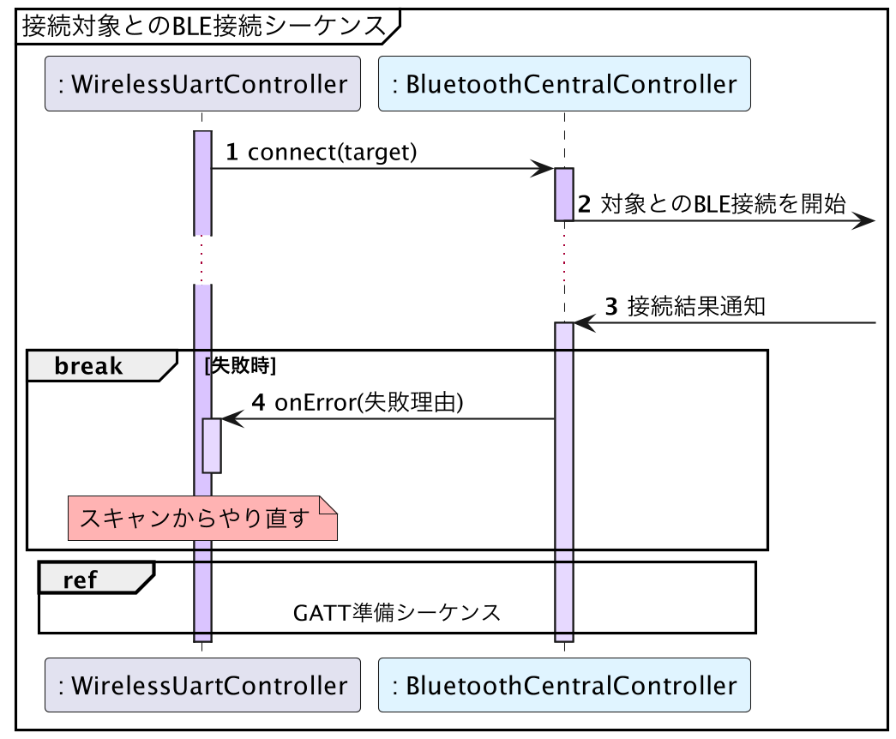

# iOS版サンプルコード - BLE接続

{docsify-updated}

> 参考: BLEとLINBLEの基本制御フロー: [BLE接続](common/flows/connect-to-target.md)
>
> 

[`CBCentralManager.connect()`](<https://developer.apple.com/documentation/corebluetooth/cbcentralmanager/connect(_:options:)>)を呼び出すことで、BLE接続を行うことができます。
引数に、[アドバタイズのスキャン](platform/ios/scan-advertisements)で取得した[`CBPeripheral`](https://developer.apple.com/documentation/corebluetooth/cbperipheral)オブジェクトを渡します。

接続結果は、[`centralManager(_:didConnect:)`](<https://developer.apple.com/documentation/corebluetooth/cbcentralmanagerdelegate/centralmanager(_:didconnect:)>)で通知されます。

!> ガベージコレクションの対象になるのを避けるため、`CBPeripheral`オブジェクトの参照を保持しておく必要があります。
