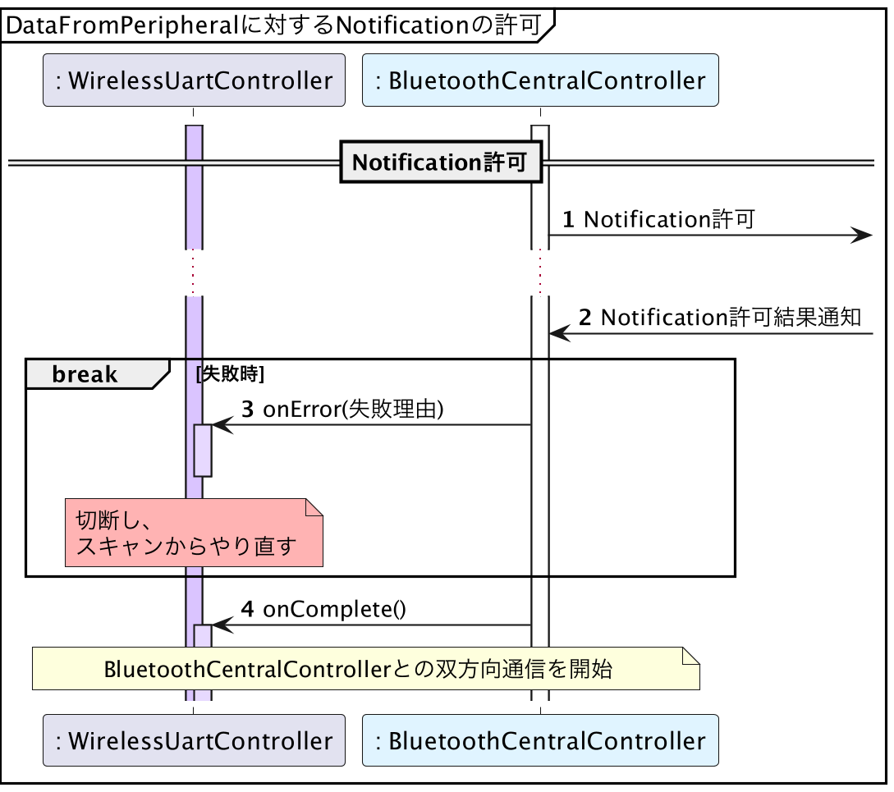

# iOS版サンプルコード - GATT準備

{docsify-updated}

> 参考: BLEとLINBLEの基本制御フロー: [GATT準備](common/flows/prepare-gatt.md)

## GATTデータベースの検索

> 参考: BLEとLINBLEの基本制御フロー: GATT準備: [GATTデータベースの検索](common/flows/prepare-gatt#gattデータベースの検索)
>
> 

サービス検索は[`CBPeripheral.discoverServices(_:)`](<https://developer.apple.com/documentation/corebluetooth/cbperipheral/discoverservices(_:)>)を呼ぶことで行われます。
このとき、引数にサービスUUIDの配列を渡すことができ、指定したサービスUUIDのみを検索対象とする事ができます。

検索が終わると、[`CBPeripheralDelegate`](https://developer.apple.com/documentation/corebluetooth/cbperipheraldelegate)の[`peripheral(_:didDiscoverServices:)`](<https://developer.apple.com/documentation/corebluetooth/cbperipheraldelegate/peripheral(_:diddiscoverservices:)>)が呼び出されます。

キャラクタリスティック検索は[`peripheral(_:didDiscoverCharacteristicsFor:error:)`](<https://developer.apple.com/documentation/corebluetooth/cbperipheral/discovercharacteristics(_:for:)>)を呼ぶことで行われます。

検索が終わると[`peripheral(_:didDiscoverCharacteristicsFor:error:)`](<https://developer.apple.com/documentation/corebluetooth/cbperipheraldelegate/peripheral(_:diddiscovercharacteristicsfor:error:)>)が呼び出されます。

## Notificationの許可

> 参考: BLEとLINBLEの基本制御フロー: GATT準備: [Notificationの許可](common/flows/prepare-gatt#notificationの許可)
>
> 

サービス・キャラクタリスティック検索完了後、Notification許可を行いたいキャラクタリスティックに関する[`CBCharacteristic`](https://developer.apple.com/documentation/corebluetooth/cbcharacteristic)オブジェクトを取り出します。

[LINBLE UART ServiceのUUID定義](common/flows/prepare-gatt#linble-uart-serviceのuuid・属性定義)は、

```swift
class Linble {
    static let linbleUartService = CBUUID(string: "27ADC9CA-35EB-465A-9154-B8FF9076F3E8")
    static let dataFromPeripheral = CBUUID(string: "27ADC9CB-35EB-465A-9154-B8FF9076F3E8")
    static let dataToPeripheral = CBUUID(string: "27ADC9CC-35EB-465A-9154-B8FF9076F3E8")
}
```

のように実装できます。

Notification許可をしたいのは`dataFromPeripheral`に関する`CBCharacteristic`です。
Swiftのコレクション操作関数[`first(where:)`](<https://developer.apple.com/documentation/swift/array/first(where:)>)を使えば、`dataFromPeripheral`の取り出しは

```swift
guard let linbleUartService = peripheral?.services?.first(where: {
    $0.uuid == Linble.linbleUartService
}) else { return }

guard let dataFromPeripheral = linbleUartService.characteristics?.first(where: {
    $0.uuid == Linble.dataFromPeripheral
}) else { return }
```

のように書けます。

取り出した`dataFromPeripheral`を使って、[`setNotifyValue(_:for:)`](<https://developer.apple.com/documentation/corebluetooth/cbperipheral/setnotifyvalue(_:for:)>)を実行することで、LINBLE側にNotification許可イベントが走り、その通信結果が[`peripheral(_:didUpdateNotificationStateFor:error:)
`](<https://developer.apple.com/documentation/corebluetooth/cbperipheraldelegate/peripheral(_:didupdatenotificationstatefor:error:)>)で通知されます。

許可イベントが成功すると、OSがこのキャラクタリスティックから発生したNotificationを受け取ったとき、このアプリにイベントを横流ししてくれるようになります。

これでLINBLEとの通信準備が完了します。
