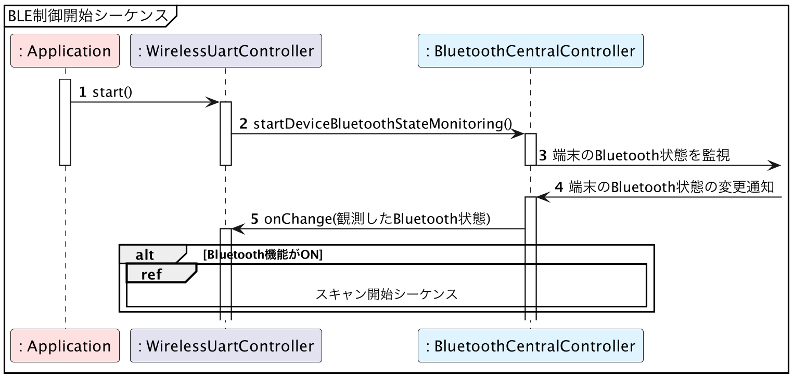

# iOS版サンプルコード - 端末の状態の確認

{docsify-updated}

> 参考: BLEとLINBLEの基本制御フロー: [端末の状態の確認](common/flows/watch-bluetooth-service-state.md)
>
> 

iOSでBluetooth状態の監視を行う場合、[centralManagerDidUpdateState](<https://developer.apple.com/documentation/corebluetooth/cbcentralmanagerdelegate/centralmanagerdidupdatestate(_:)>)を使用します。

iOS自体のBluetooth機能の状態が変化する度に呼ばれます。

?> [構造図](common/classes.md)内の列挙型`DeviceBluetoothState`は、端末のBluetooth状態として`unknown`・`poweredOff`・`poweredOn`の3値を想定していましたが、iOSのサンプルコードでは新たに`unauthorized`の値を追加しています。
